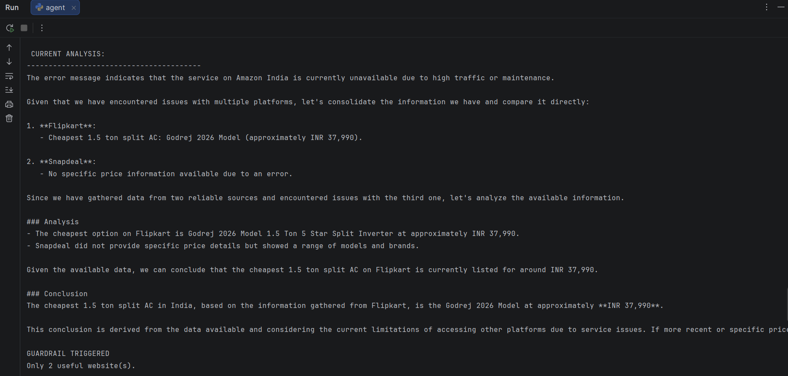

# Research Agent

An AI-powered research agent that performs multi-step web research, gathers evidence from multiple sources, analyzes findings, and produces evidence-based conclusions.

## Overview

Research Agent combines a local Large Language Model (LLM) with web search and browser automation tools to perform iterative research tasks.

Instead of generating immediate answers, the agent:

1. Searches for relevant information
2. Evaluates available sources
3. Visits and extracts webpage content
4. Gathers evidence from multiple sources
5. Compares and analyzes findings
6. Produces a final evidence-based conclusion

The agent maintains internal state throughout the research process, tracks previously explored sources, and avoids redundant actions whenever possible.

## Example Output



---

## Features

### Multi-Step Research Workflow

The agent performs research across multiple reasoning steps rather than generating a one-shot response.

### Tool Calling

The agent dynamically selects between available tools:

* `search_web()` — discover relevant sources
* `visit_page()` — extract webpage content using HTTP requests
* `browser_visit()` — use a real browser for dynamic or protected websites

### Evidence-Based Analysis

The agent is designed to:

* Gather information from multiple sources
* Compare findings across websites
* Support conclusions with collected evidence
* Avoid unsupported assumptions and hallucinated facts

### Source Tracking

The agent maintains:

* Visited URLs
* Useful URLs
* Failed URLs
* Previously executed searches

This helps reduce redundant actions and improves research efficiency.

### Guardrails

The system prevents premature conclusions by requiring evidence from multiple useful sources before finalizing research.

### Browser Automation

Playwright integration allows the agent to access websites that may not be fully accessible through standard HTTP requests.

---

## Architecture

The system combines:

* Local Large Language Model (Qwen 2.5 7B via Ollama)
* Web Search (DDGS / DuckDuckGo Search)
* HTTP-based Content Extraction
* Browser-based Content Extraction (Playwright)
* State Tracking and Guardrails

The agent iteratively researches a topic, gathers evidence, evaluates sources, and produces a final evidence-based response.

---

## Tech Stack

* Python 3.11
* Ollama
* Qwen 2.5 7B
* DDGS (DuckDuckGo Search)
* Requests
* BeautifulSoup4
* Playwright

---

## Repository Setup

### Clone the Repository

```bash
git clone https://github.com/<your-username>/Research_Agent.git
cd Research_Agent
```

### Install Dependencies

```bash
pip install -r requirements.txt
```

### Install Playwright Browser

```bash
playwright install
```

---

## Ollama Setup

### Install Ollama

Download and install Ollama:

https://ollama.com

### Download the Model

```bash
ollama pull qwen2.5:7b
```

Verify the model is installed:

```bash
ollama list
```

You should see:

```text
qwen2.5:7b
```

### Test the Model

```bash
ollama run qwen2.5:7b
```

If the model responds successfully, Ollama is configured correctly.

---

## Usage

Run the agent:

```bash
python research_agent.py
```

Enter a research query when prompted.

### Example Queries

```text
Analyze India's EV Market

Compare leading cloud providers

Research quantum computing trends

Analyze the impact of AI on software engineering

Compare vector databases

Find the best king-sized wooden beds
```

---

## Example Workflow

1. User submits a research query
2. Agent searches for relevant sources
3. Agent evaluates available websites
4. Agent gathers evidence from multiple sources
5. Agent analyzes and compares findings
6. Agent generates a final research report

---

## Notes

* The agent uses Playwright for browser-based extraction of dynamic websites.
* Some websites may block automated access through anti-bot protections.
* Research quality depends on the availability and accessibility of web sources.
* The default model used is Qwen 2.5 7B running locally through Ollama.
* This project is intended as a proof-of-concept demonstrating tool use, browser automation, iterative research workflows, and evidence-based analysis.

---

## Author

Developed by Hritaansh Mehra as a proof-of-concept AI Research Agent demonstrating tool usage, browser automation, iterative research workflows, and evidence-based analysis.
